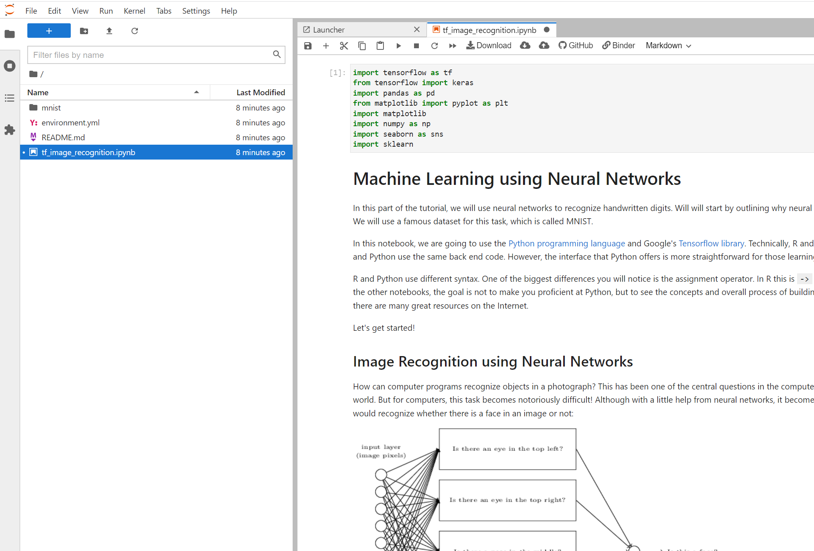
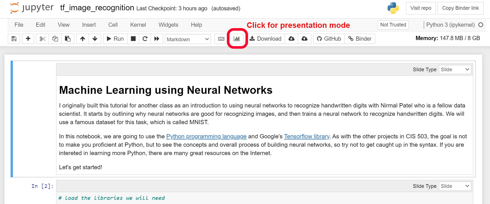

## Image Recognition using TensorFlow and Deep Neural Networks

This repository has a [Jupyter Notebook](https://jupyter.org/) that contains the code to allow you to build and test a neural network model that can recognize hand written numbers. 

There are two ways you can run the code in this notebook. If you already are familiar with Python, you can follow this [Jupyter Notebook](https://jupyter.org/) link to install all the required packages and launch the notebook on your local computer.

If you are newer to Python, you can use the MyBinder link I created below which will enable you to interact with the notebook on a hosted server. Please note that given all of the libraries (a library is a term for software packages) required, it may take several minutes to launch.

Click this button to launch notebook: [](https://mybinder.org/v2/gh/azbones/image-recognition/HEAD?filepath=tf_image_recognition.ipynb)

If you are installing Jupyter on your local computer, once the Jupyter environment is launched, click on the notebook file called "tf_image_recognition.ipynb". This will launch an interactive session where you can run and modify the code I created. This [link](https://www.dataquest.io/blog/jupyter-notebook-tutorial/) has a beginner's tutorial for using notebooks.




If you are using the Binder button above, you can enable presentation mode after it launches by "Enter RISE Slideshow" button as indicated below. The code blocks are all interactive, so you can change the code and run it using the ```ctrl-enter``` keyboard shortcut.





-Collin
